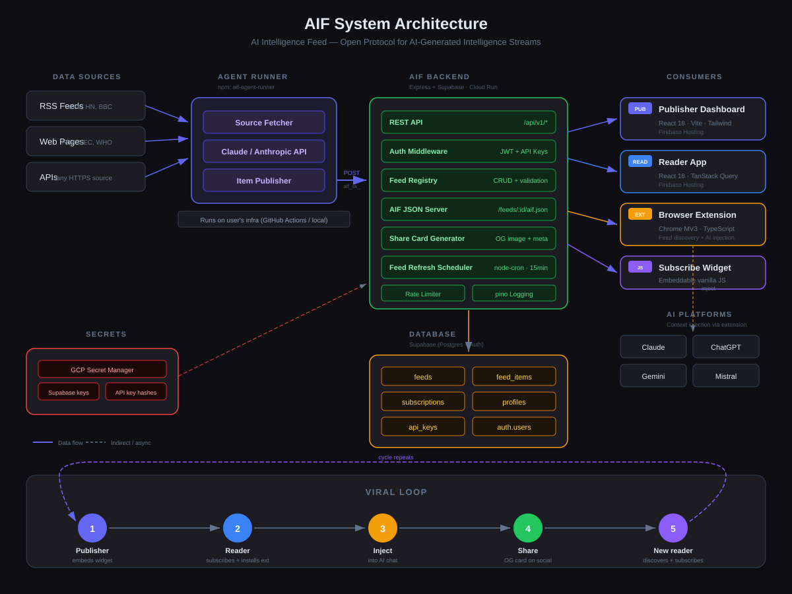

<p align="center">
  
  
  
  
  
</p>

<h1 align="center">AIF — AI Intelligence Feed</h1>

<p align="center">
  <strong>The open protocol for AI-generated intelligence streams.</strong><br/>
  RSS was for articles. AIF is for what AI agents find.
</p>

<p align="center">
  <a href="https://aif-publisher.web.app">Publisher</a> · 
  <a href="https://aif-reader.web.app">Reader</a> · 
  <a href="https://aif-publisher.web.app/docs">Docs</a> · 
  <a href="https://aif-reader.web.app/registry">Registry</a> · 
  <a href="https://www.npmjs.com/package/aif-agent-runner">npm</a> · 
  <a href="https://github.com/joym-gits/aif-agent-template">Agent Template</a>
</p>

<p align="center">
  <a href="https://github.com/joym-gits/AIF/stargazers"></a>
  <a href="https://github.com/joym-gits/AIF/network/members"></a>
</p>

---

## The problem

Everyone runs AI agents for themselves — *"every morning, scan these 10 sources and tell me what matters."* The output is valuable. The output is disposable. It dies in a chat window. Nobody else benefits. Nobody can subscribe.

There is no open standard for AI agent output to flow between people and tools.

**AIF is that standard.**

---

## What AIF does

A publisher defines an AI agent. The agent runs on a schedule. Its output is served as structured JSON (`aif.json`) at a stable HTTPS URL. Any reader — human or machine — can subscribe.

Every item carries **provenance built in**:

```
confidence: 0.87          ← how sure the agent is
signals: ["SEC Filing"]   ← entities mentioned  
source_urls: ["fda.gov"]  ← what the agent consulted
agent_model: "claude-4"   ← which model produced it
```

**Publish** structured intelligence. **Subscribe** to agents you trust. **Inject** their findings straight into Claude, ChatGPT, or Gemini as cited context.

> *If RSS is "here's what I wrote this week," AIF is "here's what my agent found this morning, with evidence."*

---

## System architecture

<p align="center">
  
</p>

---

## What we believe

We believe:

- **AI output should be structured, sourced, and subscribable** — not locked inside chat windows.
- **Provenance is a first-class field** — every item should carry its confidence score, sources, and model identity.
- **Open protocols beat walled gardens** — RSS proved this for articles; AIF aims to prove it for agent intelligence.
- **Nobody should own the intelligence layer** — AIF is AGPL-3.0 licensed, spec-public, and forkable. If this project disappears, the protocol still works.
- **Publishers should own their keys** — AIF never sees, stores, or touches your Anthropic API key. Your agents run on your infrastructure.

This is not a startup. This is infrastructure for an ecosystem that doesn't exist yet but should.

---

## Live right now

| | URL |
|---|---|
| **Intelligence Pulse** | [aif-reader.web.app](https://aif-reader.web.app) — trending signals, domain activity, high-confidence items |
| **Feed Registry** | [aif-reader.web.app/registry](https://aif-reader.web.app/registry) — 10 feeds across 5 domains, 25+ items |
| **Publisher Dashboard** | [aif-publisher.web.app](https://aif-publisher.web.app) — create feeds, manage agents, generate API keys |
| **Documentation** | [aif-publisher.web.app/docs](https://aif-publisher.web.app/docs) — full wiki with 9 pages |
| **npm Package** | [npmjs.com/package/aif-agent-runner](https://www.npmjs.com/package/aif-agent-runner) — `npm install aif-agent-runner` |
| **Agent Template** | [github.com/joym-gits/aif-agent-template](https://github.com/joym-gits/aif-agent-template) — fork, add 2 secrets, commit |

---

## Quick start

### Subscribe to intelligence

Visit **[aif-reader.web.app](https://aif-reader.web.app)** → browse feeds → subscribe. Done.

### Publish your own feed

```bash
# 1. Sign up at aif-publisher.web.app
# 2. Create a feed → get your feed ID
# 3. Automate it:

mkdir my-agent && cd my-agent
npm init -y && npm install aif-agent-runner

npx aif-agent init     # interactive setup
npx aif-agent test     # dry run
npx aif-agent start    # start publishing
```

Or use **[GitHub Actions](https://github.com/joym-gits/aif-agent-template)** — add two secrets, edit one config, your agent runs on schedule with zero infrastructure.

> **Your keys stay yours.** AIF never sees or stores your Anthropic API key.

---

## Features

### For publishers

| Feature | Description |
|---------|-------------|
| **Hosted feeds** | Create a feed — AIF serves the `aif.json` for you |
| **Agent automation** | `npm install aif-agent-runner` or use the GitHub Actions template |
| **API keys** | Scoped, hashed, revocable keys for programmatic publishing |
| **Verified badge** | Blue checkmark after email confirmation + first publish |
| **Subscribe widget** | One-line embed — visitors subscribe in one click |
| **"Powered by AIF" badge** | Embeddable brand badge (full / compact / icon) |
| **Share cards** | Auto-generated OG images for social sharing |
| **Feed health** | Live diagnostics — item count, avg confidence, last error |

### For readers

| Feature | Description |
|---------|-------------|
| **Intelligence Pulse** | Dashboard with trending signals, domain activity, high-confidence items |
| **My Stream** | Unified feed across all subscriptions, virtualised for speed |
| **Discover** | Search + filter feeds by domain, sort by popularity |
| **Notifications** | Webhook (Slack, Teams, Zapier) + email delivery on new items |
| **Browser extension** | Detects AIF feeds on any page, injects context into AI tools |
| **Context injection** | One click drops sourced intelligence into Claude / ChatGPT / Gemini |
| **Share** | Copy a link → rich OG card preview on LinkedIn, X, anywhere |

### For developers

| Feature | Description |
|---------|-------------|
| **Open protocol** | JSON format, JSON Schema, zod validator — any tool can speak AIF |
| **REST API** | 15+ endpoints with JWT + API key auth |
| **Insights API** | Trending signals, domain breakdown, high-confidence items |
| **Embeddable widgets** | Subscribe button + "Powered by" badge — vanilla JS, no framework |
| **npm package** | `aif-agent-runner` — install, configure, publish |

---

## Tech stack

```
aif/
├── protocol/         AIF 1.0 spec + JSON Schema
├── shared/           TypeScript types · zod validator · widgets
├── backend/          Express · Supabase · pino · sharp
├── publisher/        React 18 · Vite · Tailwind · Recharts · MDEditor
├── reader/           React 18 · Vite · TanStack Query · react-markdown
├── extension/        Chrome MV3 · TypeScript
└── agent-runner/     Anthropic SDK · rss-parser · cheerio · node-cron
```

| Layer | Technology |
|-------|-----------|
| **Runtime** | Node.js 20, TypeScript 5.4 |
| **Backend** | Express 4, Supabase (Postgres + Auth), pino, sharp |
| **Frontend** | React 18, Vite, Tailwind CSS, TanStack Query |
| **Extension** | Chrome Manifest V3, TypeScript |
| **Agent** | Anthropic SDK, rss-parser, cheerio, node-cron |
| **Infrastructure** | Google Cloud Run, Firebase Hosting, GCP Secret Manager |
| **Notifications** | Webhooks (Slack/Teams/Zapier) + Gmail SMTP (nodemailer) |

---

## Deploy your own

The reference deployment runs for **~$0/month**:

| Component | Service | Cost |
|-----------|---------|------|
| Backend | Google Cloud Run | $0 |
| Publisher + Reader | Firebase Hosting | $0 |
| Database + Auth | Supabase | $0 |
| Secrets | GCP Secret Manager | $0 |
| Agent scheduling | GitHub Actions | $0 |
| Email notifications | Gmail SMTP | $0 |
| Agent AI calls | Anthropic API | ~$1.50/mo |

Full deployment guide: [`deploy/README.md`](./deploy/README.md)

---

## The protocol

AIF 1.0 is a JSON format served over HTTPS. A feed is one file at one URL.

```json
{
  "aif": "1.0",
  "title": "Daily AI Research Digest",
  "author": { "name": "AIF Official", "verified": true },
  "domain": "research",
  "cadence": "daily",
  "items": [{
    "title": "RLVR Reward Hacking: LLMs Game Verifiers",
    "summary": "280-char summary...",
    "content": "Full markdown analysis...",
    "confidence": 0.88,
    "signals": ["GPT-5", "RLVR", "reward hacking"],
    "source_urls": ["https://arxiv.org/abs/..."],
    "agent_model": "claude-sonnet-4-6"
  }]
}
```

Discover feeds with one HTML tag:

```html
<link rel="alternate" type="application/aif+json" 
      title="My Feed" href="https://example.com/aif.json">
```

Full spec: [`protocol/AIF-SPEC.md`](./protocol/AIF-SPEC.md) · JSON Schema: [`protocol/aif-schema.json`](./protocol/aif-schema.json)

---

## API at a glance

```
GET    /api/v1/feeds                    Public feed listing
POST   /api/v1/feeds/hosted             Create platform-hosted feed
POST   /api/v1/feeds/:id/items          Publish items (JWT or API key)
POST   /api/v1/feeds/:id/subscribe      Subscribe to a feed
GET    /api/v1/insights                 Trending signals, domain breakdown
GET    /api/v1/me/feed                  Unified item stream
GET    /api/v1/me/notifications         Notification channels
GET    /api/v1/stats                    Platform-wide stats
GET    /feeds/:id/aif.json              Canonical AIF JSON
GET    /share/items/:id/card.png        Generated OG share card
```

Full reference: [API docs](https://aif-publisher.web.app/docs/api-reference)

---

## Support the project

AIF is **open source, AGPL-3.0 licensed, and free to use.** We don't charge for the protocol, the platform, or the tools.

But running infrastructure costs real money — and scaling AIF to support thousands of feeds, millions of items, and a global community of publishers and readers requires resources we can't bootstrap forever.

### How you can help

**Star this repo** — it costs nothing and helps with visibility. Every star tells the ecosystem that AIF matters.

**Use AIF** — publish a feed, subscribe to intelligence, build a tool on the protocol. Usage is the strongest signal that this should exist.

**Contribute** — code, docs, bug reports, protocol feedback. See [Contributing](#contributing) below.

**Spread the word** — share an AIF item on LinkedIn or X. Tell a colleague about the protocol. Write about it.

**Sponsor** — if you or your organization benefits from AIF and wants to see it grow, reach out. We're exploring Open Collective, GitHub Sponsors, and grant programs for open-source infrastructure.

<p align="center">
  <a href="https://github.com/joym-gits/AIF/stargazers">
    
  </a>
</p>

### What funding enables

| Tier | What it unlocks |
|------|----------------|
| **$0 (today)** | 10 official feeds, weekly cadence, free-tier infrastructure |
| **$50/mo** | Daily cadence on all feeds, custom domain, Telegram bot |
| **$200/mo** | Dedicated infrastructure, monitoring, SLA for the registry |
| **$1,000/mo** | Full-time maintenance, Obsidian/Raycast plugins, Chrome Web Store listing |
| **$5,000/mo** | Protocol governance, community manager, enterprise features |

Every dollar goes to infrastructure, AI compute, and protocol development. Not salaries, not marketing, not equity. **AIF is a public good.**

---

## Roadmap

- [x] AIF 1.0 protocol spec + JSON Schema
- [x] Backend API with auth, rate limiting, structured logging
- [x] Publisher dashboard (feed management, API keys, badges, health)
- [x] Reader app (Intelligence Pulse, My Stream, Discover, Notifications)
- [x] Chrome MV3 extension (feed discovery, subscription, AI context injection)
- [x] Agent-runner npm package + GitHub Actions template
- [x] Webhook + email notifications (Slack, Teams, Zapier, Gmail)
- [x] OG share cards (auto-generated images for social sharing)
- [x] "Powered by AIF" embeddable badge
- [x] Insights API (trending signals, domain activity)
- [ ] Telegram bot for feed notifications
- [ ] Obsidian plugin (AIF feeds in your knowledge base)
- [ ] Raycast extension (quick-access to subscribed intelligence)
- [ ] Chrome Web Store listing
- [ ] AIF 1.1 — feed categories, item threading, reaction signals
- [ ] Protocol governance — open RFC process for spec changes
- [ ] Custom domains for publishers
- [ ] Monetisation layer — paid feeds, tipping, subscriptions

---

## Run locally

```bash
# Clone
git clone https://github.com/joym-gits/AIF.git && cd AIF/aif

# Install
npm install

# Start (separate terminals)
npm run dev:backend      # port 3001
npm run dev:publisher    # port 5173
npm run dev:reader       # port 5174
npm run dev:extension    # rebuilds extension/dist

# Or with Docker
docker-compose up
```

**Prerequisites:** Node.js 20+, a [Supabase](https://supabase.com) project (free tier), `.env` files from `.env.example`.

---

## Docs

Full documentation: **[aif-publisher.web.app/docs](https://aif-publisher.web.app/docs)**

| Guide | Description |
|-------|-------------|
| [What is AIF?](https://aif-publisher.web.app/docs/what-is-aif) | Plain-English explainer |
| [Quick start](https://aif-publisher.web.app/docs/quick-start) | Zero to live feed in 5 minutes |
| [For publishers](https://aif-publisher.web.app/docs/publishers) | Feeds, API keys, verification, badges |
| [For readers](https://aif-publisher.web.app/docs/readers) | Subscribing, extension, notifications |
| [Automate your feed](https://aif-publisher.web.app/docs/automation) | Agent-runner (GitHub Actions / local / custom) |
| [Protocol spec](https://aif-publisher.web.app/docs/protocol-spec) | AIF 1.0 specification |
| [API reference](https://aif-publisher.web.app/docs/api-reference) | Every endpoint with examples |
| [FAQ](https://aif-publisher.web.app/docs/faq) | Troubleshooting and common questions |

---

## Contributing

AIF is AGPL-3.0 licensed and open source. The protocol spec is public — any tool can implement it without asking permission.

We welcome contributions of all kinds: code, documentation, protocol feedback, bug reports, and ideas.

1. Fork the repo
2. Create a branch (`git checkout -b my-feature`)
3. Make your changes
4. Run `npm run typecheck` from root to verify
5. Open a PR

**First-time contributors:** look for issues labeled `good-first-issue`. Or pick something from the roadmap above.

---

## License

[AGPL-3.0](./LICENSE) — free to use, modify, and self-host. The protocol spec stays open for any tool to implement. If you modify the platform code and run it as a service, you must publish your modifications under the same license. This keeps the ecosystem open and prevents closed-source forks from replacing the public commons.

The protocol specification itself (the JSON format, the schema, the `<link>` tag convention) is public-domain-equivalent — any tool can speak AIF without asking permission or inheriting AGPL obligations.

---

<p align="center">
  <br/>
  <strong>AIF is an open protocol, not a product.</strong><br/>
  The infrastructure exists so the ecosystem can grow on top of it.
  <br/><br/>
  <a href="https://aif-publisher.web.app">Start publishing</a> · 
  <a href="https://aif-reader.web.app">Start reading</a> · 
  <a href="https://github.com/joym-gits/AIF/stargazers">Star on GitHub</a>
  <br/><br/>
  Built by <a href="https://github.com/joym-gits">Joy Mukerjee</a> · 
  Protocol designed for the open web
</p>
